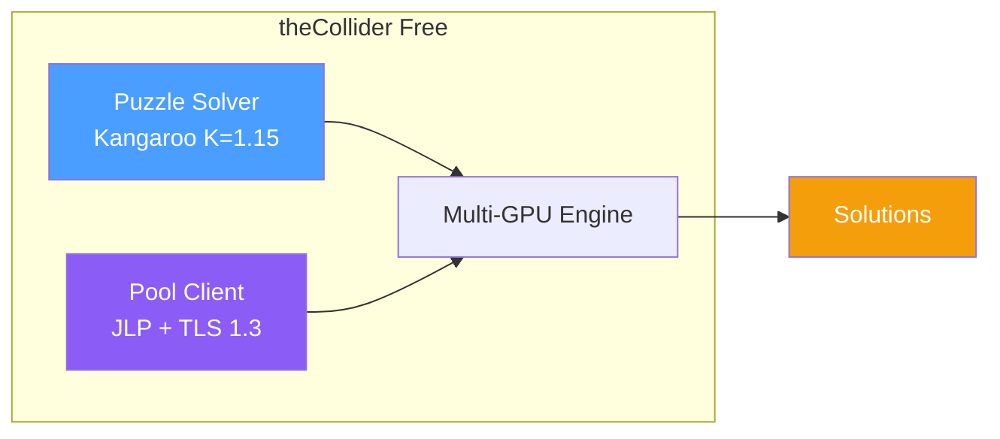
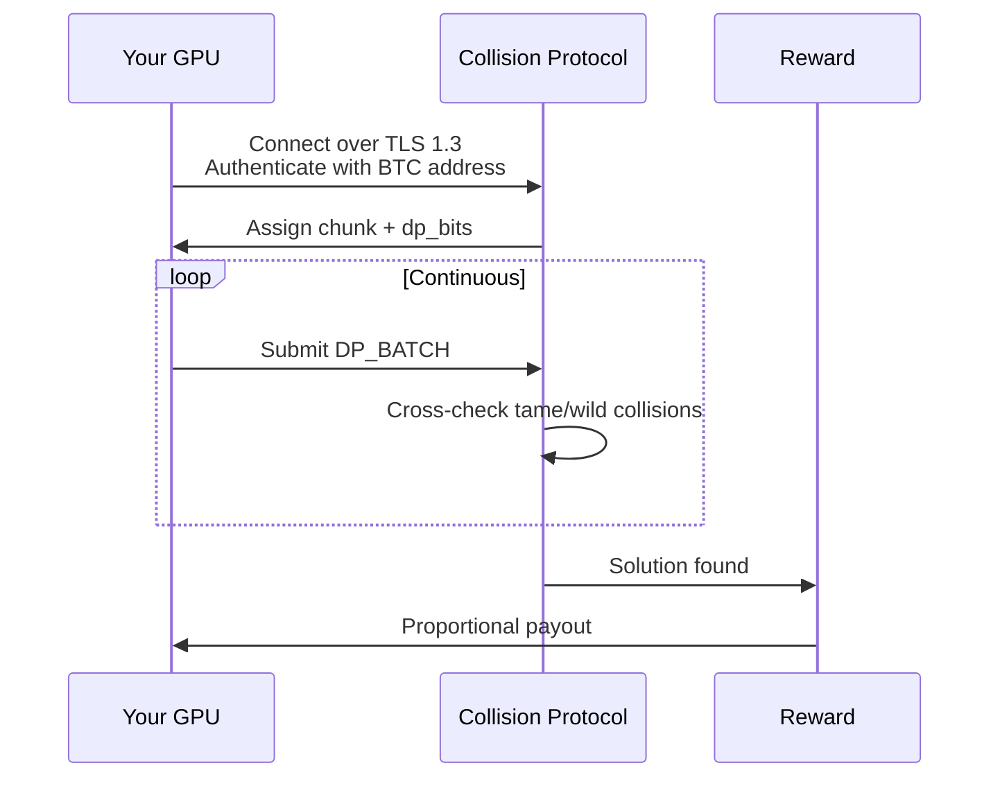

<p align="center">
  
</p>

<h1 align="center">theCollider</h1>

<p align="center">
  <strong>GPU-accelerated Bitcoin Puzzle solver with built-in pool client</strong>
</p>

<p align="center">
  <a href="#what-it-does">What it does</a> •
  <a href="#quick-start">Quick start</a> •
  <a href="#performance">Performance</a> •
  <a href="#pool-mining">Pool</a> •
  <a href="#documentation">Docs</a> •
  <a href="#pro-edition">Pro</a>
</p>

<p align="center">
  
  
  
  
  
  
</p>

---

## What it does

The **Bitcoin Puzzle Challenge** locks ~1000 BTC behind 256 progressively harder private-key ranges. Cracking the high-bit puzzles individually is computationally infeasible; the realistic path is collaborative computation across many GPUs.

**theCollider Free** is the puzzle-solving piece of that path:

- **Pollard's Kangaroo** with the K=1.15 symmetry exploit (RCKangaroo), runs on every NVIDIA GPU back to compute capability 7.5 (RTX 20-series and newer). 8 GKeys/s on a single RTX 4090.
- **JLP pool client** that talks to [collisionprotocol.com](https://collisionprotocol.com) (or any compatible JLP server) over TLS 1.3 with hostname verification. Connect a worker, get assigned a chunk, stream distinguished points, watch your share grow.
- **Cross-machine session share**: workers on multiple boxes that use the same Bitcoin payout address aggregate server-side -- your dashboard shows your real contribution percentage across every machine, not per-box subtotals.
- **Multi-platform**: Linux x64 (CUDA), Windows x64 (CUDA), macOS arm64 (Metal/CPU fallback for pool mode).



---

## Performance

| Mode | Hardware | Throughput |
|---|---|---|
| Kangaroo (CUDA) | RTX 4090 | ~8 GKeys/s |
| Kangaroo (CUDA) | RTX 3090 | ~4 GKeys/s |
| Kangaroo (CUDA) | RTX 3060 + 2060 SUPER (combined) | ~2.7 GKeys/s |
| Pool client (Metal/CPU) | Apple M-series | ~200 KKeys/s -- works, but pool worker payoff is dominated by GPU contributors |

Pool mode on Apple Silicon connects, authenticates, and submits DPs reliably, but at dp_bits=35 the statistically expected time-to-first-DP on CPU alone is hours-to-days. **For meaningful pool earnings you want a CUDA GPU.**

---

## Quick start

### Download

Grab the latest binary for your platform from [Releases](https://github.com/hevnsnt/collider/releases/latest):

| Platform | Asset |
|---|---|
| Linux x64 (CUDA) | `collider` |
| Windows x64 (CUDA) | `collider.exe` |
| macOS arm64 | `collider-macos-arm64` |

Verify the download with the `SHA256SUMS.txt` published on the same release.

### Run

```bash
# Solo: solve a specific puzzle locally
./collider --puzzle 71 --kangaroo

# Pool: contribute to the global puzzle 135 effort
./collider --pool jlps://collisionprotocol.com:17403 --worker bc1qYourBtcAddress

# Interactive menu (no args)
./collider
```

```
+==============================================================+
|                       theCollider v1.2.1                     |
+==============================================================+

What would you like to do?

  [1] Solve Bitcoin Puzzle Challenge
  [2] Run Benchmark
  [3] Show Help
  [0] Exit
```

### Configure (optional)

Drop a `config.yml` next to the binary for persistent settings -- pool URL, worker address, GPU selection. See [example-config.yml](example-config.yml) and the [Configuration guide](docs/CONFIGURATION.md).

```yaml
pool:
  url: "jlps://collisionprotocol.com:17403"
  worker: "bc1qYourBitcoinAddress"

gpu:
  devices: []   # empty = auto-detect all GPUs
```

---

## Pool mining

Solo-solving Puzzle #135 with consumer hardware would take many human lifetimes. Pool mining splits the work across all connected GPUs and pays proportionally based on distinguished points contributed.



| Component | Details |
|---|---|
| Fee | 5% (infrastructure, development) |
| Payout | Proportional to your distinguished points |
| Verification | 72-hour period, then payout within 7 days |
| Transport | JLP protocol over TLS 1.3 with hostname verification |

The on-screen progress display refreshes every 10 seconds via a `STATS_REQ` to the pool server:

```
Speed: 2.70 GKeys/s | Local DPs: 47 | Sent: 47 | Your total: 1.2K | Pool total: 4.6K | Session share: 26.1%
```

`Your total` aggregates server-side across every machine using the same BTC payout address -- run on a Mac and a Windows box at once and you'll see one combined number, not two.

[Pool economics ->](docs/POOL-ECONOMICS.md)

---

## Documentation

| Document | Description |
|---|---|
| [Install](docs/INSTALL.md) | Build from source |
| [Build (Linux)](docs/BUILD-LINUX.md) | Linux + CUDA |
| [Build (Windows)](docs/BUILD-WINDOWS.md) | Windows + MSVC + vcpkg |
| [Build (macOS)](docs/BUILD-MACOS.md) | macOS arm64 |
| [Usage](docs/USAGE.md) | Command reference |
| [Configuration](docs/CONFIGURATION.md) | `config.yml` reference |
| [Architecture](docs/ARCHITECTURE.md) | How the GPU pipeline + pool client fit together |
| [Bitcoin Puzzle strategy](docs/BITCOIN-PUZZLE-STRATEGY.md) | Why pool mining wins on the high-bit puzzles |
| [Pool economics](docs/POOL-ECONOMICS.md) | Fee, payout calc, examples |
| [Changelog](docs/CHANGELOG.md) | Version history |

---

## System requirements

### Minimum (puzzle solver, CUDA path)
- NVIDIA GPU, compute capability 7.5+ (RTX 20-series or newer)
- 8 GB GPU VRAM
- 16 GB system RAM
- CUDA 12.x runtime

### Recommended
- RTX 3090 / 4090 / 5090, or multiple GPUs
- 24+ GB GPU VRAM
- 64 GB system RAM

### macOS
- Apple Silicon (M1 or newer), macOS 12+
- Connects to the pool and runs a CPU-side kangaroo. Compute throughput is well below CUDA hardware; pool earnings will reflect that.

---

## Pro edition

theCollider Pro adds the brain-wallet pipeline: GPU-accelerated SHA-256 -> secp256k1 -> RIPEMD-160 with hashcat-compatible rule engine, PCFG-trained passphrase generation, Markov-chain candidate streaming, WarpWallet/scrypt support, and bloom-filter opportunistic address scanning against ~36 M known funded BTC addresses.

If your interest is the puzzle challenge, the Free build is the whole solution. If you also want to research brain wallets, see [collisionprotocol.com/pro](https://collisionprotocol.com/pro).

---

## Legal & ethics

theCollider is built for:
- Security research and education
- Authorized penetration testing
- Recovering wallets you own
- Academic cryptography research

Do not use it to access wallets you do not own.

---

## Acknowledgments

- [RetiredCoder](https://github.com/RetiredCoder) -- RCKangaroo
- [JeanLucPons](https://github.com/JeanLucPons) -- original GPU Kangaroo work
- [bitcoin-core/secp256k1](https://github.com/bitcoin-core/secp256k1) -- reference EC implementation

---

## License

MIT -- see [LICENSE](LICENSE).

Third-party components: RCKangaroo (GPLv3, RetiredCoder); secp256k1 primitives (MIT, bitcoin-core).

---

<p align="center">
  <a href="https://collisionprotocol.com">collisionprotocol.com</a> •
  <a href="docs/INSTALL.md">Install</a> •
  <a href="docs/USAGE.md">Documentation</a> •
  <a href="https://github.com/hevnsnt/collider/issues">Issues</a>
</p>
