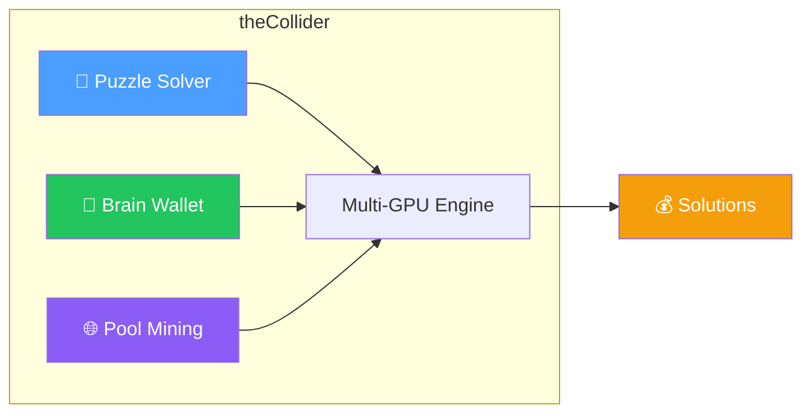
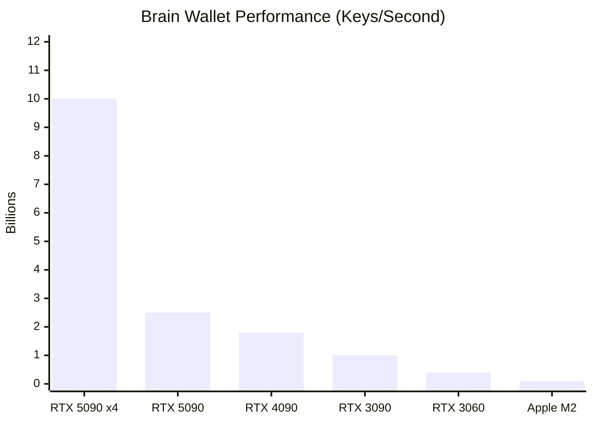
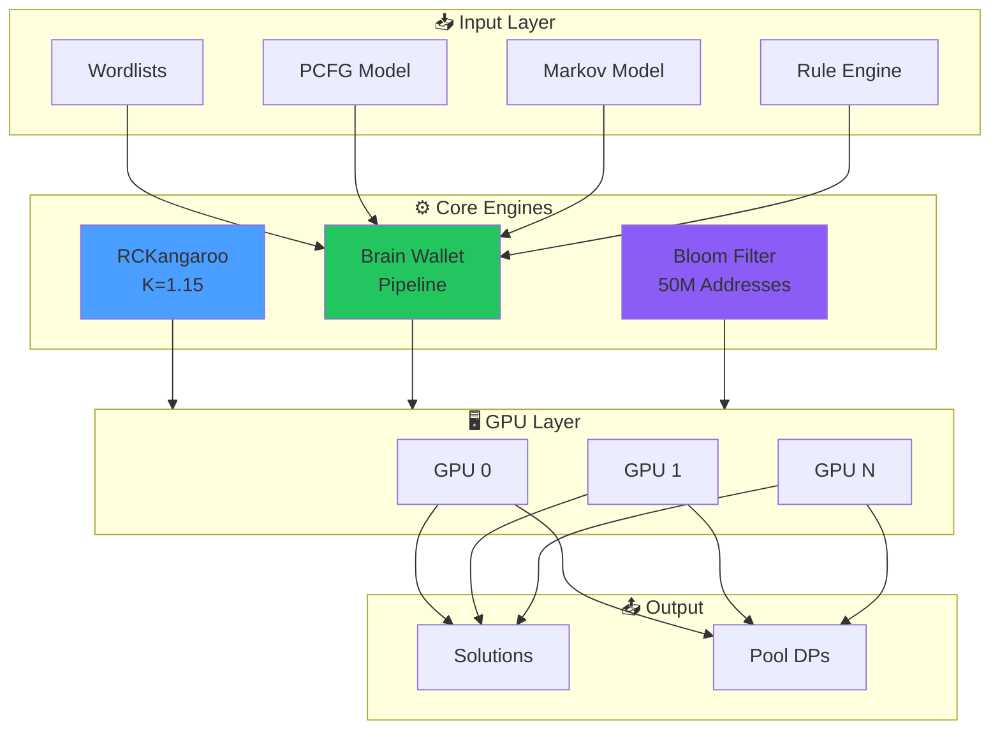
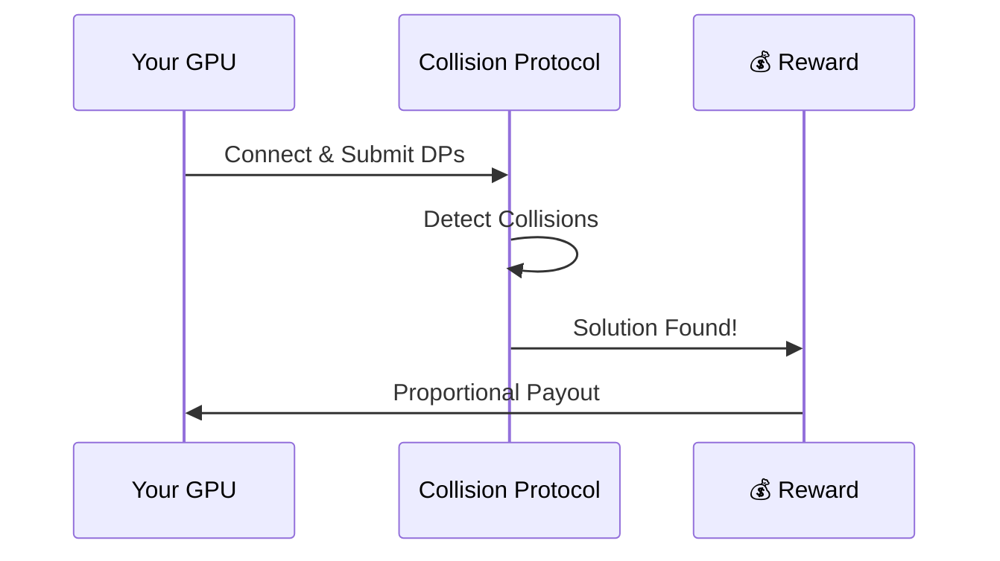

<p align="center">
  
</p>

<h1 align="center">theCollider</h1>

<p align="center">
  <strong>The Most Advanced GPU-Accelerated Bitcoin Puzzle Solver & Brain Wallet Scanner</strong>
</p>

<p align="center">
  <a href="#features">Features</a> •
  <a href="#performance">Performance</a> •
  <a href="#quick-start">Quick Start</a> •
  <a href="#documentation">Documentation</a> •
  <a href="#pool">Pool Mining</a>
</p>

<p align="center">
  
  
  
  
  
  
</p>

---

## Why theCollider?

The **Bitcoin Puzzle Challenge** offers 1000 BTC across 256 addresses with progressively harder private key ranges. **Brain wallets** represent millions of Bitcoin addresses derived from weak passphrases. Both challenges require specialized tools that combine raw GPU power with intelligent algorithms.

**theCollider** is the definitive solution—integrating the fastest Kangaroo solver (K=1.15), a fused GPU brain wallet pipeline, and intelligent passphrase generation into a single, unified tool.



---

## Features

<table>
<tr>
<td width="50%">

### 🚀 Kangaroo Solver (K=1.15)
State-of-the-art Pollard's Kangaroo with symmetry exploitation. **40-80% faster** than competing implementations.

### 🧠 Brain Wallet Scanner  
Fused GPU pipeline: SHA256 → secp256k1 → RIPEMD160 → Bloom. **10B+ keys/second** on 4x RTX 5090.

### 🎯 PCFG Generation
Learn password patterns from wordlists. Test `bitcoin123` before `xq7$mZpK`.

</td>
<td width="50%">

### 🔗 Markov Chains
Character-level probability models generate password-like candidates not in your wordlists.

### 🔐 WarpWallet/Scrypt
Full scrypt implementation for WarpWallet-style brain wallets with email salt.

### 🌐 Pool Integration
Native Collision Protocol client for distributed puzzle solving.

</td>
</tr>
</table>

---

## Performance



| Mode | Hardware | Performance | Notes |
|------|----------|-------------|-------|
| **Kangaroo** | RTX 4090 | 8 GKeys/s | K=1.15 optimal |
| **Kangaroo** | RTX 3090 | 4 GKeys/s | K=1.15 optimal |
| **Brain Wallet** | 4× RTX 5090 | 10B+ keys/s | Target config |
| **Brain Wallet** | 1× RTX 4090 | 1.8B keys/s | High-end consumer |
| **Brain Wallet** | Apple M2 | 100M keys/s | Metal backend |

---

## Quick Start

### Interactive Mode (Recommended)

```bash
# Windows
collider.exe

# Linux / macOS
./collider
```

```
+==============================================================+
|                       theCollider v1.1                       |
+==============================================================+

What would you like to do?

  [1] Solve Bitcoin Puzzle Challenge
  [2] Brain Wallet Scanner
  [3] Run Benchmark
  [4] Show Help

Enter choice (1-4):
```

### Command Line

```bash
# Join the puzzle-solving pool
./collider --pool jlp://pool.collisionprotocol.com:17403 --worker YOUR_BTC_ADDRESS

# Scan for brain wallets
./collider --brainwallet --bloom funded.blf --wordlist rockyou.txt

# Solve a specific puzzle
./collider --puzzle 135 --kangaroo
```

### Configuration File

Create `config.yml` for persistent settings:

```yaml
pool:
  url: "jlp://pool.collisionprotocol.com:17403"
  worker: "bc1qYourBitcoinAddress"

brainwallet:
  wordlist: "./processed/combined.txt"
  
gpu:
  devices: []  # Empty = all GPUs
```

📖 **[Full Configuration Guide →](docs/CONFIGURATION.md)**

---

## Architecture



📖 **[Full Architecture Documentation →](docs/ARCHITECTURE.md)**

---

## Pool Mining

**Solo solving Puzzle #135 would take ~195 years** with 4× RTX 4090. The only realistic path is collaborative computation.



### Pool Economics

| Component | Details |
|-----------|---------|
| **Fee** | 5% (infrastructure, development, support) |
| **Payout** | Proportional to Distinguished Points contributed |
| **Verification** | 72-hour period, then payout within 7 days |

**Example: Puzzle #135 (13.5 BTC)**
```
Net Distribution:    12.825 BTC (after 5% fee)
Your Contribution:   2.4M DPs (24% of pool)
Your Payout:         3.078 BTC
```

📖 **[Pool Economics Deep Dive →](docs/POOL-ECONOMICS.md)**

---

## Comparison

| Feature | theCollider | BitCrack | VanitySearch | KeyHunt |
|---------|:-----------:|:--------:|:------------:|:-------:|
| Kangaroo (K=1.15) | ✅ | ❌ | ❌ | ⚠️ K=1.6+ |
| Brain Wallet | ✅ | ❌ | ❌ | ⚠️ Limited |
| PCFG Generation | ✅ | ❌ | ❌ | ❌ |
| Markov Chains | ✅ | ❌ | ❌ | ❌ |
| WarpWallet/Scrypt | ✅ | ❌ | ❌ | ❌ |
| Bloom Filter | ✅ | ❌ | ❌ | ❌ |
| macOS (Metal) | ✅ | ❌ | ❌ | ⚠️ |
| Pool Integration | ✅ | ❌ | ❌ | ❌ |
| Interactive Mode | ✅ | ❌ | ❌ | ❌ |

---

## Documentation

| Document | Description |
|----------|-------------|
| 📖 [Installation Guide](docs/INSTALL.md) | Build instructions for all platforms |
| 📖 [Usage Guide](docs/USAGE.md) | Complete command reference |
| 📖 [Architecture](docs/ARCHITECTURE.md) | Technical deep-dive |
| 📖 [Configuration](docs/CONFIGURATION.md) | config.yml reference |
| 📖 [Bitcoin Puzzle Strategy](docs/BITCOIN-PUZZLE-STRATEGY.md) | Puzzle-solving approach |
| 📖 [PCFG Integration](docs/PCFG-INTEGRATION.md) | Password pattern learning |
| 📖 [Changelog](docs/CHANGELOG.md) | Version history |

---

## System Requirements

### Minimum
- NVIDIA GPU (Compute 6.0+) or Apple Silicon
- 8 GB GPU VRAM
- 16 GB System RAM
- CUDA 11.0+ or macOS 12+

### Recommended
- NVIDIA RTX 3090/4090/5090 or multiple GPUs
- 24+ GB GPU VRAM
- 64 GB System RAM
- NVMe storage for wordlists

---

## What's New in v1.1

<details>
<summary><strong>🆕 Click to expand version 1.1.0 highlights</strong></summary>

### New Features
- **PCFG Training**: Learn password patterns, generate candidates by probability
- **WarpWallet/Scrypt**: Full scrypt support for WarpWallet brain wallets
- **Markov Chains**: Character-level probability models for smart generation
- **Parallel Bloom Loading**: N-1x speedup for N GPUs
- **True Double Buffering**: Up to 2x throughput improvement

### Bug Fixes
- Fixed brainwallet mode incorrectly activating pool mode
- Fixed MSVC compilation errors (extern "C" linkage)
- Fixed Kangaroo tames generation
- Removed compiler warnings

📖 **[Full Changelog →](docs/CHANGELOG.md)**

</details>

---

## Legal & Ethics

theCollider is designed for:
- ✅ Security research and education
- ✅ Authorized penetration testing  
- ✅ Recovery of your own wallets
- ✅ Academic cryptographic research

⚠️ **Do not use this tool to access wallets you do not own.**

---

## Acknowledgments

- **[RetiredCoder](https://github.com/RetiredCoder)** - RCKangaroo implementation
- **[JeanLucPons](https://github.com/JeanLucPons)** - Original Kangaroo GPU work
- **[ryancdotorg](https://github.com/ryancdotorg)** - Brainflayer concepts
- **bitcoin-core/secp256k1** - Reference EC implementation

---

## License

MIT License - see [LICENSE](LICENSE) for details.

Third-party components:
- RCKangaroo: GPLv3 (RetiredCoder)
- secp256k1 primitives: MIT

---

<p align="center">
  <strong>theCollider</strong> — Because some problems are worth solving.
</p>

<p align="center">
  <a href="https://collisionprotocol.com">Website</a> •
  <a href="docs/INSTALL.md">Install</a> •
  <a href="docs/USAGE.md">Documentation</a> •
  <a href="https://github.com/hevnsnt/theCollider/issues">Issues</a>
</p>
