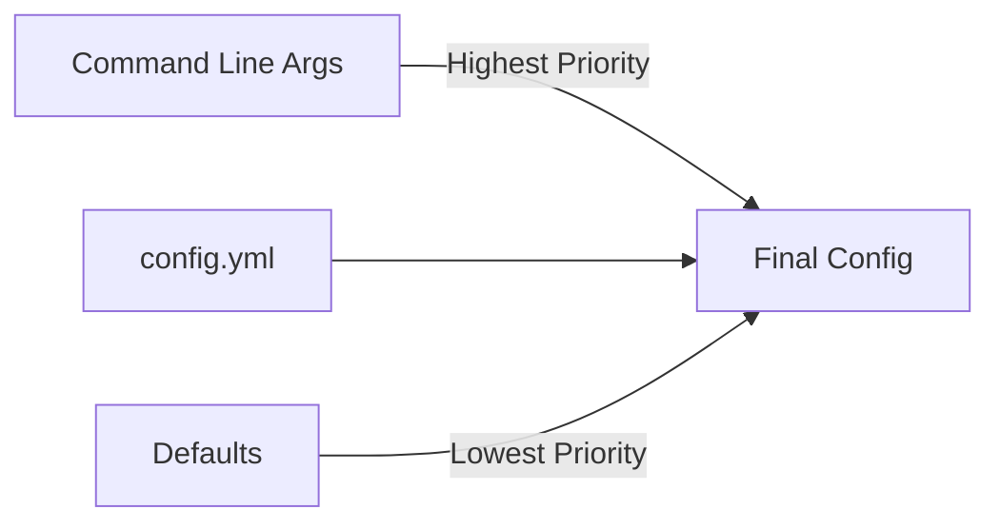
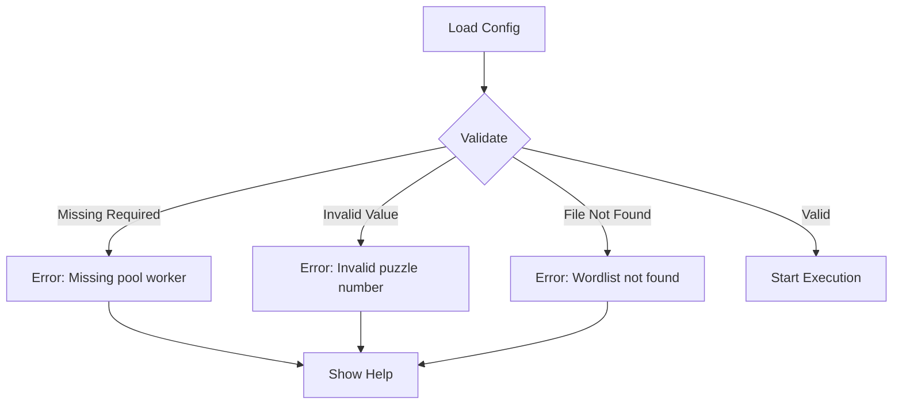

# Configuration Guide

> Complete reference for theCollider's configuration options.

---

## Configuration Methods

theCollider supports three configuration methods (in order of precedence):



1. **Command-line arguments** — Override everything
2. **config.yml file** — Persistent settings
3. **Built-in defaults** — Fallback values

---

## config.yml Reference

### File Location

theCollider searches for `config.yml` in this order:

1. `./config.yml` — Current working directory
2. `~/.collider/config.yml` — Home directory (Linux/macOS)
3. `%USERPROFILE%\.collider\config.yml` — Home directory (Windows)

### Complete Example

```yaml
# ============================================================================
# theCollider Configuration File
# ============================================================================

# ----------------------------------------------------------------------------
# Pool Mining Configuration
# ----------------------------------------------------------------------------
pool:
  # Pool server URL (jlp://host:port or http://host:port)
  url: "jlp://pool.collisionprotocol.com:17403"
  
  # Your Bitcoin address for reward distribution (REQUIRED for pool mode)
  worker: "bc1qYourBitcoinAddress"
  
  # Pool password (optional, most pools don't require this)
  password: ""
  
  # API key for HTTP-based pools (optional)
  api_key: ""

# ----------------------------------------------------------------------------
# Puzzle Solving Configuration
# ----------------------------------------------------------------------------
puzzle:
  # Target puzzle number (66-160). Set to 0 for auto-selection.
  number: 0
  
  # Use smart selection to pick best puzzle by ROI (true/false)
  smart_select: true
  
  # Minimum puzzle bit size to consider (0 = no minimum)
  min_bits: 0
  
  # Maximum puzzle bit size to consider
  max_bits: 160
  
  # Use Pollard's Kangaroo algorithm (faster for large puzzles)
  kangaroo: true
  
  # Distinguished point bits (-1 = auto-calculate optimal)
  dp_bits: -1
  
  # Use random starting positions (true) or sequential search (false)
  random_search: true
  
  # Auto-progress to next puzzle after solving
  auto_next: false
  
  # Checkpoint file for saving/resuming progress
  checkpoint: ""

# ----------------------------------------------------------------------------
# Brainwallet Scanning Configuration
# ----------------------------------------------------------------------------
brainwallet:
  # Enable brainwallet scanning mode
  enabled: false
  
  # Path to processed wordlist file
  wordlist: ""
  
  # Save progress interval (every N passphrases)
  save_interval: 1000000
  
  # Resume from previous saved state
  resume: false

# ----------------------------------------------------------------------------
# Bloom Filter Configuration
# ----------------------------------------------------------------------------
bloom:
  # Path to bloom filter file for address checking
  # Supports: UTXO bloom, address bloom, or H160 bloom
  file: ""

# ----------------------------------------------------------------------------
# GPU Configuration
# ----------------------------------------------------------------------------
gpu:
  # GPU device IDs to use (empty = auto-detect all available)
  # Example: [0, 1] for first two GPUs
  devices: []
  
  # Batch size for GPU operations (0 = auto-calibrated)
  batch_size: 0
  
  # Force GPU calibration on startup
  force_calibrate: false

# ----------------------------------------------------------------------------
# Performance & Debug Settings
# ----------------------------------------------------------------------------
settings:
  # Enable verbose output
  verbose: false
  
  # Enable debug output (shows internal state)
  debug: false
  
  # Benchmark duration in seconds
  benchmark_seconds: 30

# ----------------------------------------------------------------------------
# Paths Configuration
# ----------------------------------------------------------------------------
paths:
  # Directory for processed data (wordlists, bloom filters)
  data_dir: "./processed"
  
  # Directory for checkpoints and save states
  checkpoint_dir: "./checkpoints"
  
  # Directory for output logs
  log_dir: "./logs"
```

---

## Section Reference

### Pool Configuration

```yaml
pool:
  url: "jlp://pool.collisionprotocol.com:17403"
  worker: "bc1qYourBitcoinAddress"
```

| Key | Type | Default | Description |
|-----|------|---------|-------------|
| `url` | string | `""` | Pool server URL. Protocols: `jlp://`, `http://` |
| `worker` | string | `""` | Your Bitcoin address for payouts |
| `password` | string | `""` | Pool password (rarely needed) |
| `api_key` | string | `""` | API key for HTTP pools |

### Puzzle Configuration

```yaml
puzzle:
  number: 135
  kangaroo: true
  dp_bits: -1
```

| Key | Type | Default | Description |
|-----|------|---------|-------------|
| `number` | int | `0` | Target puzzle (0 = auto-select) |
| `smart_select` | bool | `true` | Auto-select best ROI puzzle |
| `kangaroo` | bool | `true` | Use Kangaroo algorithm when possible |
| `dp_bits` | int | `-1` | Distinguished point bits (-1 = auto) |
| `random_search` | bool | `true` | Random vs sequential starting positions |
| `min_bits` | int | `0` | Minimum puzzle bit size |
| `max_bits` | int | `160` | Maximum puzzle bit size |

### Brainwallet Configuration

```yaml
brainwallet:
  enabled: true
  wordlist: "./processed/combined.txt"
  save_interval: 1000000
```

| Key | Type | Default | Description |
|-----|------|---------|-------------|
| `enabled` | bool | `false` | Enable brainwallet mode |
| `wordlist` | string | `""` | Path to wordlist file |
| `save_interval` | int | `1000000` | Checkpoint interval (passphrases) |
| `resume` | bool | `false` | Resume from checkpoint |

### GPU Configuration

```yaml
gpu:
  devices: [0, 1]
  batch_size: 0
```

| Key | Type | Default | Description |
|-----|------|---------|-------------|
| `devices` | int[] | `[]` | GPU IDs to use (empty = all) |
| `batch_size` | int | `0` | Batch size (0 = auto) |
| `force_calibrate` | bool | `false` | Force GPU calibration |

---

## Command-Line Arguments

Command-line arguments override config.yml settings.

### Pool Mode

```bash
./collider --pool <url> --worker <btc_address> [--password <pwd>]
```

| Argument | Short | Description |
|----------|-------|-------------|
| `--pool` | `-p` | Pool URL |
| `--worker` | `-w` | Worker name (your BTC address) |
| `--password` | | Pool password |

### Puzzle Mode

```bash
./collider --puzzle <num> [--kangaroo] [--dp-bits <n>]
```

| Argument | Short | Description |
|----------|-------|-------------|
| `--puzzle` | | Puzzle number (66-160) |
| `--kangaroo` | `-k` | Use Kangaroo algorithm |
| `--dp-bits` | | Distinguished point bits |
| `--smart-select` | | Auto-select best puzzle |
| `--no-smart` | | Disable smart selection |
| `--random` | | Random starting positions |
| `--sequential` | | Sequential starting positions |

### Brainwallet Mode

```bash
./collider --brainwallet --bloom <file> --wordlist <file>
```

| Argument | Short | Description |
|----------|-------|-------------|
| `--brainwallet` | `-b` | Enable brainwallet mode |
| `--bloom` | | Bloom filter file |
| `--wordlist` | | Wordlist file |
| `--warpwallet` | | Enable WarpWallet mode |
| `--salt` | | WarpWallet salt (email) |
| `--resume` | | Resume from checkpoint |

### General Options

```bash
./collider --gpu 0,1 --verbose --debug
```

| Argument | Short | Description |
|----------|-------|-------------|
| `--gpu` | `-g` | GPU device IDs (comma-separated) |
| `--benchmark` | | Run benchmark |
| `--verbose` | `-v` | Verbose output |
| `--debug` | `-d` | Debug output |
| `--help` | `-h` | Show help |
| `--config` | `-c` | Config file path |

---

## Common Configurations

### Solo Puzzle Solving

```yaml
puzzle:
  number: 135
  kangaroo: true
  dp_bits: -1  # Auto-calculate
  random_search: true

gpu:
  devices: []  # Use all GPUs
```

### Pool Mining

```yaml
pool:
  url: "jlp://pool.collisionprotocol.com:17403"
  worker: "bc1qYourBitcoinAddress"

puzzle:
  kangaroo: true

settings:
  verbose: false
```

### Brainwallet Scanning

```yaml
brainwallet:
  enabled: true
  wordlist: "./processed/combined_wordlist.txt"
  save_interval: 1000000
  resume: false

bloom:
  file: "./funded_addresses.blf"

gpu:
  devices: []
  batch_size: 0  # Auto-calibrate
```

### Multi-GPU Setup

```yaml
gpu:
  # Only use GPUs 0 and 2 (skip GPU 1)
  devices: [0, 2]
  
  # Or use all available GPUs
  # devices: []
```

### Development/Debug

```yaml
settings:
  verbose: true
  debug: true

gpu:
  devices: [0]  # Single GPU for testing
  force_calibrate: true
```

---

## Environment Variables

Some settings can be overridden via environment variables:

| Variable | Description |
|----------|-------------|
| `COLLIDER_CONFIG` | Path to config file |
| `COLLIDER_DEBUG` | Enable debug mode (`1` or `0`) |
| `COLLIDER_GPU_DEVICES` | GPU IDs (comma-separated) |

```bash
# Example
COLLIDER_DEBUG=1 COLLIDER_GPU_DEVICES=0,1 ./collider --brainwallet
```

---

## Validation

theCollider validates configuration on startup:



### Common Validation Errors

| Error | Cause | Solution |
|-------|-------|----------|
| `Pool URL required` | Missing `pool.url` | Add pool URL or use interactive mode |
| `Worker name required` | Missing `pool.worker` | Add your BTC address |
| `Bloom filter not found` | Invalid `bloom.file` path | Check file path |
| `Invalid puzzle number` | `puzzle.number` out of range | Use 66-160 or 0 for auto |

---

## Tips

1. **Start with interactive mode** to generate a working config
2. **Use `--debug`** to see exactly what configuration is being used
3. **Keep secrets out of config.yml** — Use `--password` on command line instead
4. **Auto-calibration is usually best** — Only override `batch_size` if you know what you're doing

---

*Need help? Run `./collider --help` or see [USAGE.md](USAGE.md)*
