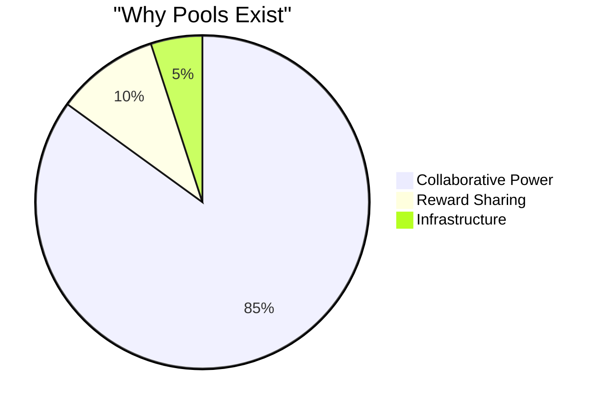
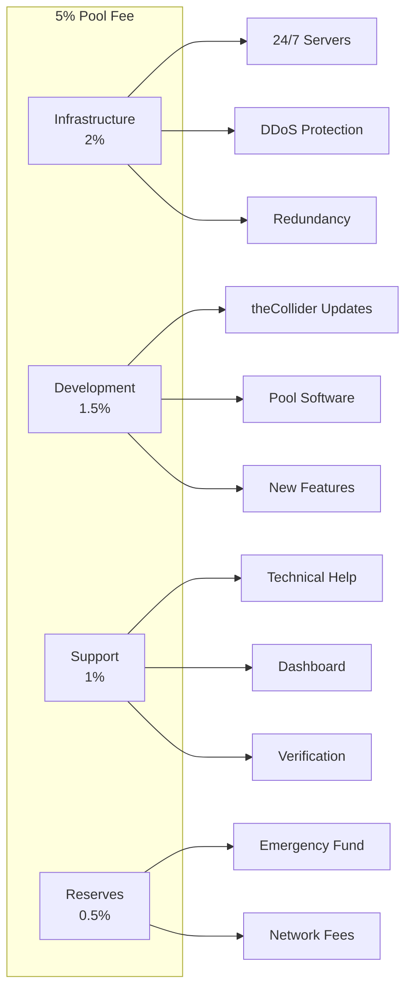
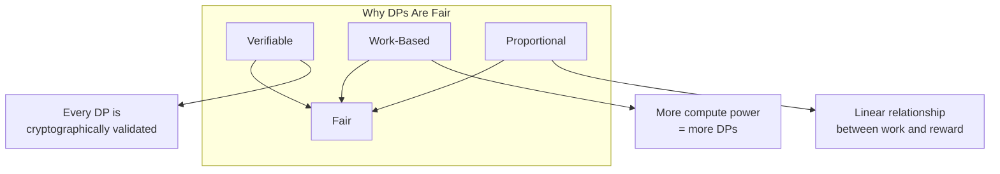
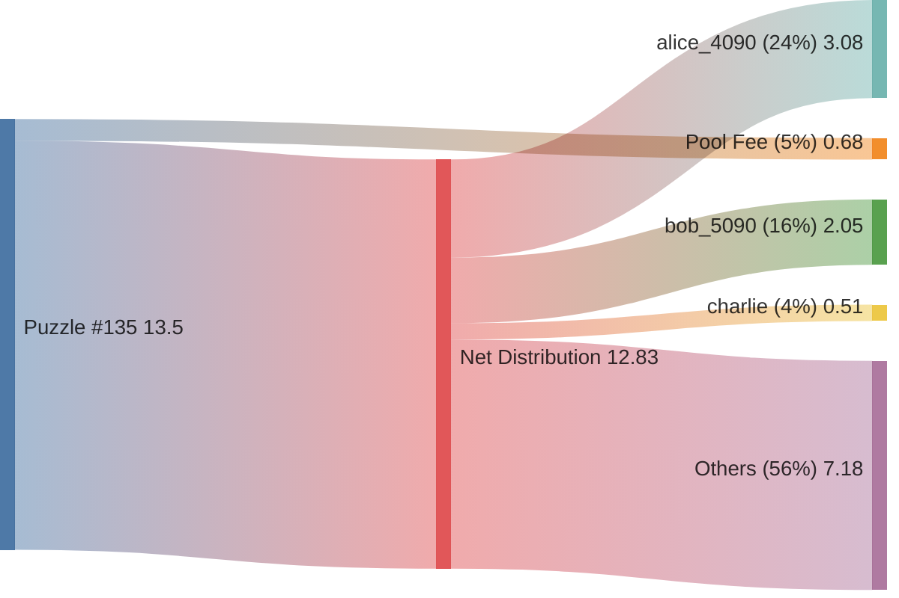
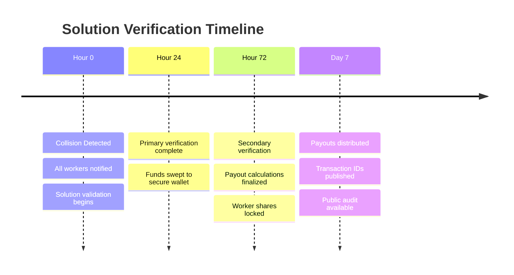
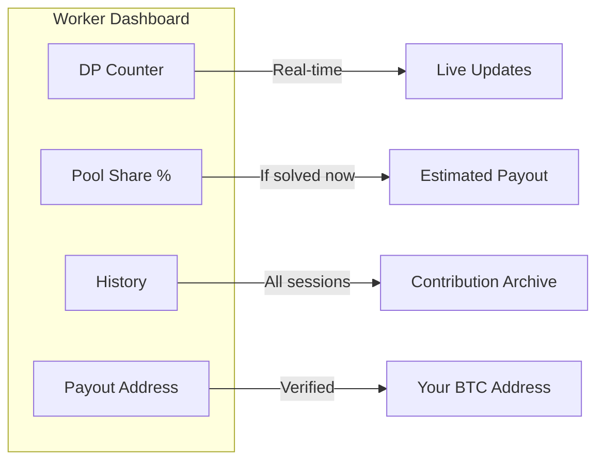
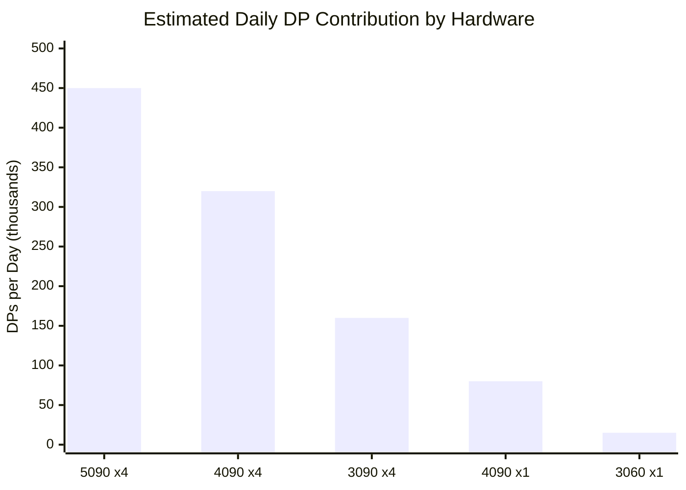

# Pool Economics

> Complete transparency about how Collision Protocol rewards are calculated and distributed.

---

## Overview

**Solo solving Puzzle #135 is mathematically impractical.** Even with the most powerful consumer hardware (4× RTX 5090), you're looking at 150+ years of continuous computation. Collaborative pool mining is the only realistic approach.



---

## The 5% Pool Fee

We believe in complete transparency. Here's exactly what the pool fee covers:



| Component | Allocation | What It Covers |
|-----------|:----------:|----------------|
| **Infrastructure** | 2% | 24/7 server operation, redundant systems, DDoS protection |
| **Development** | 1.5% | Continuous improvements to theCollider and pool software |
| **Support** | 1% | Technical assistance, dashboard maintenance, verification |
| **Reserves** | 0.5% | Emergency fund, Bitcoin network transaction fees |

---

## Payout Calculation

Rewards are distributed **proportionally based on Distinguished Points (DPs) contributed**.

### Why DPs?



1. **DPs are mathematically verifiable** — Every submission is cryptographically validated
2. **DPs represent actual work** — More computational power = more DPs = larger share
3. **No luck bonus** — The worker who finds the collision doesn't get extra; it's pure probability

### Calculation Formula

```
Your Payout = (Your DPs / Total Pool DPs) × Net Reward

Where:
  Net Reward = Gross Reward × (1 - 0.05)
             = Gross Reward × 0.95
```

---

## Example Payout

### Puzzle #135 Solved (13.5 BTC)



| Worker | Hardware | DPs Contributed | Share | Payout |
|--------|----------|----------------:|------:|-------:|
| alice_4090 | 4× RTX 4090 | 2,400,000 | 24.0% | 3.078 BTC |
| bob_5090 | 2× RTX 5090 | 1,600,000 | 16.0% | 2.052 BTC |
| charlie | 1× RTX 4090 | 400,000 | 4.0% | 0.513 BTC |
| *997 others* | *Various* | 5,600,000 | 56.0% | 7.182 BTC |
| **TOTAL** | | **10,000,000** | **100%** | **12.825 BTC** |

---

## Verification Period

When a collision is detected and the private key is recovered:



### Why 72 Hours?

1. **Validation** — Ensures the solution is mathematically correct
2. **Security** — Funds are swept to a multi-sig wallet before any payouts
3. **Accuracy** — Allows time to calculate exact DP contributions
4. **Transparency** — Gives workers time to verify their contribution counts

---

## Your Dashboard

Every worker gets access to real-time statistics:



| Metric | Description |
|--------|-------------|
| **Real-time DP Count** | Watch your contributions accumulate |
| **Pool Statistics** | Total DPs, connected workers, estimated progress |
| **Historical Data** | Your contribution history across sessions |
| **Payout Address** | Set and verify your BTC receiving address |
| **Estimated Share** | Current percentage of pool if solved now |

---

## Expected Returns

### Hardware ROI Estimates

Based on current pool statistics and Puzzle #135 parameters:



| Hardware | Daily DPs | Pool Share* | Monthly BTC** |
|----------|----------:|------------:|-------------:|
| 4× RTX 5090 | ~450,000 | ~4.5% | ~0.58 BTC |
| 4× RTX 4090 | ~320,000 | ~3.2% | ~0.41 BTC |
| 4× RTX 3090 | ~160,000 | ~1.6% | ~0.21 BTC |
| 1× RTX 4090 | ~80,000 | ~0.8% | ~0.10 BTC |
| 1× RTX 3060 | ~15,000 | ~0.15% | ~0.02 BTC |

*\*Based on 10M total daily DPs pool-wide*
*\*\*Assuming puzzle solved within 30 days*

> ⚠️ **Important**: These are estimates only. Actual returns depend on:
> - Total pool hashrate
> - Time to solution (probabilistic)
> - Your uptime and connection stability

---

## Connecting to the Pool

### Quick Start

```bash
# Interactive mode (recommended)
./collider
# Select [1] Solve Bitcoin Puzzle Challenge → [2] Join Pool

# Command line
./collider --pool jlp://pool.collisionprotocol.com:17403 --worker YOUR_BTC_ADDRESS
```

### config.yml (Recommended)

```yaml
pool:
  url: "jlp://pool.collisionprotocol.com:17403"
  worker: "bc1qYourBitcoinAddress"  # Your payout address
  password: ""                       # Optional

settings:
  debug: false
```

---

## FAQ

<details>
<summary><strong>What happens if I disconnect?</strong></summary>

Your already-submitted DPs are permanently recorded. When you reconnect, you continue earning from where you left off. There's no penalty for disconnecting.

</details>

<details>
<summary><strong>Can I change my payout address?</strong></summary>

Yes, but changes take effect after the current work period. Contact support if you need to update urgently.

</details>

<details>
<summary><strong>How do I verify my contribution?</strong></summary>

The dashboard shows your DP count in real-time. After a puzzle is solved, a full audit is published with every worker's contribution.

</details>

<details>
<summary><strong>What if the pool finds a solution while I'm offline?</strong></summary>

You receive your proportional share based on DPs submitted before the solution was found. DPs submitted after the solution don't count toward that puzzle.

</details>

<details>
<summary><strong>Is there a minimum payout?</strong></summary>

The minimum payout is 0.001 BTC to cover network fees. Smaller balances roll over to the next puzzle.

</details>

---

## Security

### Pool Security Measures

- **Multi-signature wallets** for all prize funds
- **Cold storage** for long-term holdings
- **DDoS protection** on all infrastructure
- **Rate limiting** to prevent spam submissions
- **Cryptographic verification** of all DPs

### Your Security

- **Never share your private keys** — The pool only needs your public Bitcoin address
- **Use a dedicated address** — Don't reuse addresses from exchanges
- **Verify the pool URL** — Only connect to `pool.collisionprotocol.com`

---

*Questions? Contact support@collisionprotocol.com*
